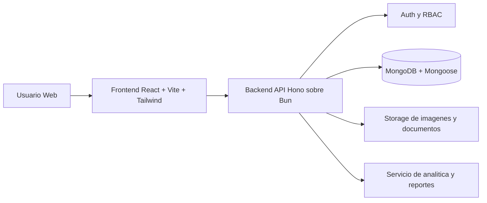
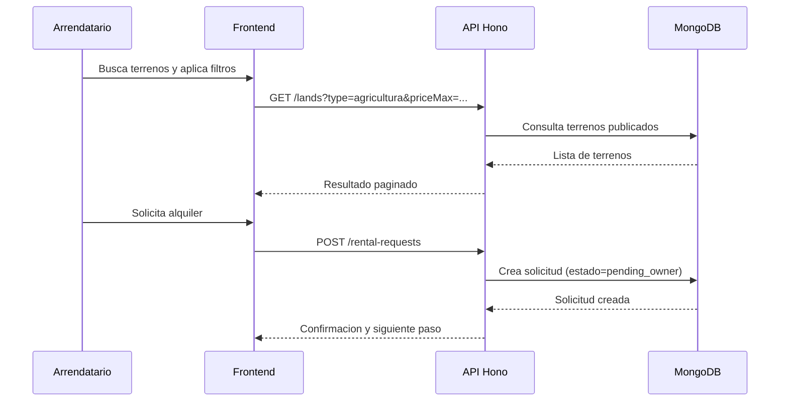

# Arquitectura tecnica - TerraShare

## 1. Stack acordado
- Frontend: React + Vite + Clerk (unificado en `apps/web`)
- Backend: Bun + Hono (`apps/backend-api`)
- Base de datos: MongoDB + Mongoose
- Runtime y package manager: Bun
- Testing E2E: Playwright
- CI/CD: GitHub Actions

## 2. Estructura de apps
```
apps/
  web/           # Frontend unificado (landing + dashboard + admin)
  backend-api/   # API Bun + Hono
  legacy/        # Apps anteriores (referencia)
packages/
  shared/       # DTOs y tipos compartidos
```

## 3. Diagrama de arquitectura


## 4. Flujo principal de alquiler


## 5. Modulos backend (v1)
- auth: registro/login, sesiones, permisos por rol
- users: perfil y configuraciones
- lands: CRUD de terrenos
- rental-requests: solicitudes y estados
- contracts: resumen de acuerdos (fase inicial)
- payments: pagos dentro de la app (fase 1, alcance basico)
- chat: mensajeria interna y exposicion de canal externo cuando aplique
- analytics: metricas para dashboard
- admin: moderacion de contenido, usuarios y reportes

## 6. Modelo de datos inicial (alto nivel)
- User: role, profile, status
- Land: ownerId, location, area, allowedUses, priceRule, availability
- RentalRequest: landId, tenantId, period, intendedUse, status
- Contract: rentalRequestId, terms, status
- AuditEvent: actorId, entity, action, metadata

## 7. Seguridad base
- Password hashing robusto
- JWT o cookie session segura (a definir)
- RBAC por rol y ownership
- Validacion de payload en todos los endpoints
- Rate limiting por IP y usuario
- Logs de auditoria para acciones sensibles

## 8. Calidad y entrega
- PR con checks obligatorios en GitHub Actions
- Tests E2E minimos con Playwright para rutas criticas
- Convencion de commit y branch por issue

## 9. Topologia de modulos (monorepo)
- landing: sitio publico de marketing y captacion.
- app-web: aplicacion principal para propietarios y arrendatarios.
- admin-dashboard: panel de administracion.
- backend-api: API Hono sobre Bun.
- packages/shared: contratos de datos, utilidades y tipos compartidos.

## 10. Acceso y autenticacion
- Modo invitado (sin login): ver landing, listado de terrenos y mapa con filtros.
- Requiere login: publicar terreno, solicitar alquiler, pagos, chat interno y panel admin.
- Acceso admin: solo rol administrador.
